# Smart Room IoT

IoT smart room system with 2 custom PCBs, ESP32, XBee RF communication, MQTT, and a mobile app. Controls room lighting (dimmable via TRIAC), a solenoid valve, and a fan relay, while monitoring temperature, humidity, and gas levels in real time.

## Context
- **Date:** 2019
- **Institution:** Universidad Politecnica de Yucatan (UPY)
- **Course/Event:** Embedded Systems / IoT
- **Type:** University Project
- **Team:** Josmar Villanueva, Jorge Blancas, Eleser Dominguez, Freddy Barredos, Andres Moguel

## What It Does
An ESP32 main board connects to WiFi and an MQTT broker, receiving commands from a mobile app. The app provides toggles for LED, valve, and fan relay, plus sliders for dimmable lights (0-100%). Dimmer commands are relayed wirelessly via XBee RF modules to PIC16F88 dimmer boards that control AC light bulbs using TRIAC phase angle control. The ESP32 also reads a DHT11 (temperature/humidity) and MQ-2 (gas) sensor, publishing readings back to the app.

### System Architecture
```
Mobile App (MQTT Dashboard)
       ↕ MQTT
ESP32 Main Board (WiFi + XBee RF)
  ├── DHT11 → Temperature/Humidity → App
  ├── MQ-2 → Gas Level → App
  ├── LED → Direct GPIO control
  ├── Valve → Direct GPIO control
  ├── Fan → Relay control
  └── XBee RF ──→ PIC16F88 Dimmer Board(s)
                    ├── TRIAC → Blue Light (ID 16)
                    └── TRIAC → Green Light (ID 17)
```

### RF Protocol
The ESP32 sends 4-character commands via XBee to PIC dimmers:
`[ID_tens][ID_units][value_tens][value_units]`
Example: `"1650"` = device ID 16, dimmer value 50%

## Hardware Components

### ESP32 Main Board (PCB 1)
| Component | Purpose |
|-----------|---------|
| ESP32 | WiFi + MQTT + main controller |
| XBee module | RF communication with dimmer boards |
| DHT11 | Temperature and humidity sensor |
| MQ-2 | Gas/smoke sensor (analog) |
| Relay module (Omron) | Fan control |
| Solenoid valve | Water/gas valve control |
| Screw terminals | Valve out, valve in, power supply |

### PIC16F88 Dimmer Board (PCB 2)
| Component | Purpose |
|-----------|---------|
| PIC16F88 | Dimmer controller (CCS C) |
| XBee module | RF communication with ESP32 |
| TRIAC + zero-crossing circuit | AC phase angle dimming |
| Screw terminals | LOAD (lamp) + AC INPUT |

## Tech Stack
- ESP32 (Arduino IDE, FreeRTOS capable)
- PIC16F88 (CCS C compiler)
- MQTT (Adafruit MQTT library + CloudMQTT broker)
- XBee RF modules (serial bridge between boards)
- DHT11, MQ-2 sensors
- TRIAC AC dimming with zero-crossing detection
- Mobile app: MQTT Dashboard (Android)

## How to Run
1. Upload `smart-room-controller.ino` to ESP32 via Arduino IDE. Configure WiFi and MQTT credentials.
2. Compile `serial-dimmer/v8-uart-timeout.c` with CCS C compiler and load to PIC16F88. Set device ID in code.
3. Install MQTT Dashboard app on phone and configure feeds.

## Files

| Path | Description |
|------|-------------|
| `smart-room-controller.ino` | ESP32 main controller: WiFi, MQTT, sensors, relay/valve control, XBee RF dimmer commands |
| `esp32-mqtt-dimmer.ino` | Earlier test version: ESP32 FreeRTOS dual-core with MQTT + local TRIAC dimmer (proof of concept) |
| `serial-dimmer/v1-v8` | 8 development iterations of the PIC16F88 TRIAC dimmer, from basic serial control to multi-channel with device ID addressing and robust UART timeout |

## Images

### Custom PCBs
| | |
|---|---|
| 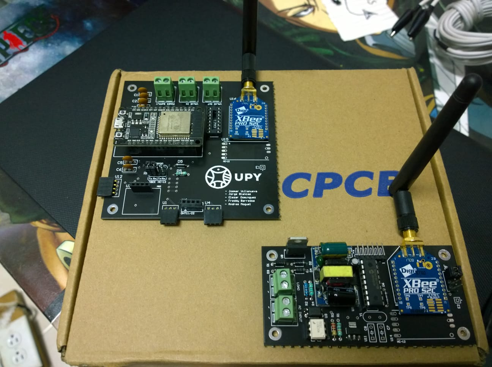 | 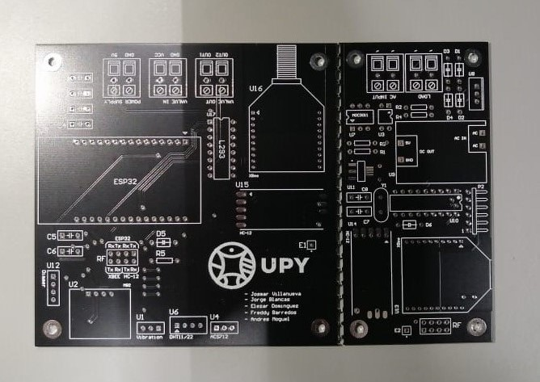 |
| ESP32 main board (left) and PIC dimmer board (right) with XBee modules | PCB panel layout: ESP32 board + PIC dimmer board |

| |
|---|
| 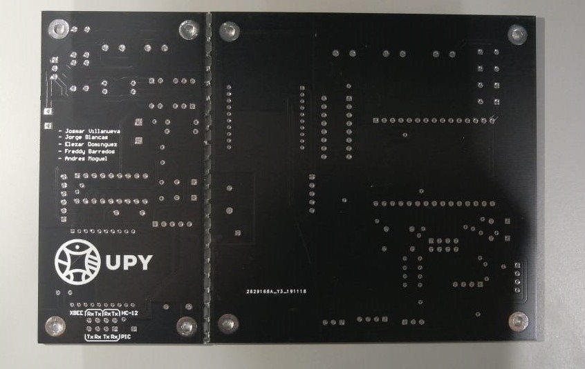 |
| Back of the PCB panel showing team credits and XBee/HC-12/PIC headers |

### ESP32 Main Board
| | |
|---|---|
| 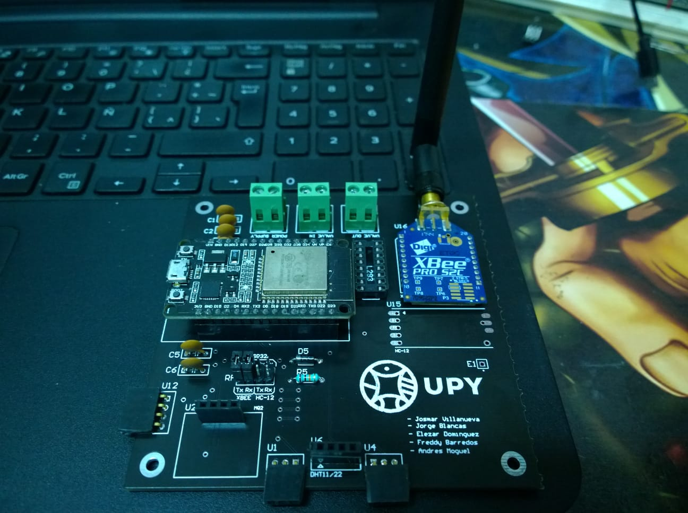 | 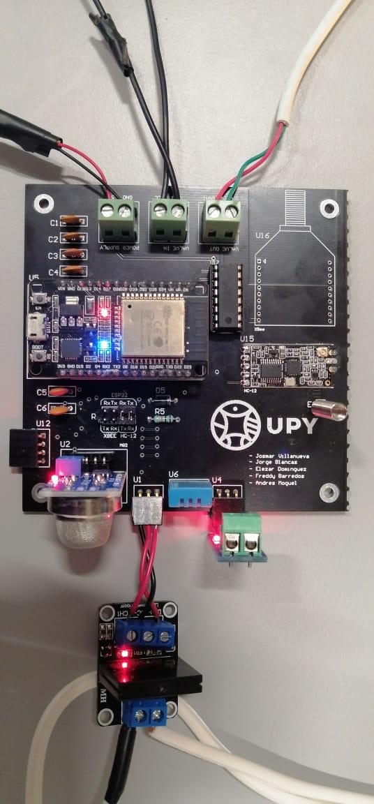 |
| ESP32 board with XBee module and UPY logo | Mounted board with DHT11, MQ-2 gas sensor, and relay module |

| |
|---|
| 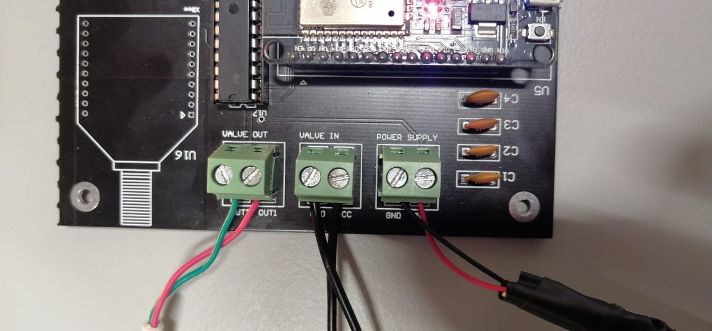 |
| Bottom terminals: VALVE OUT, VALVE IN, POWER SUPPLY |

### PIC Dimmer Board
| | |
|---|---|
| 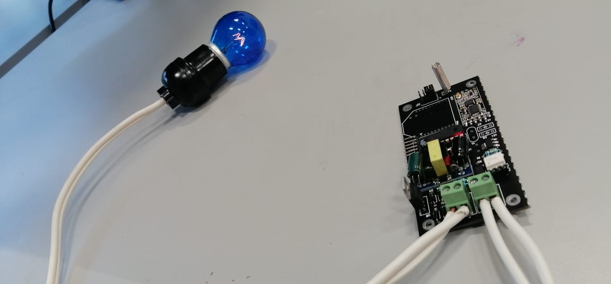 | 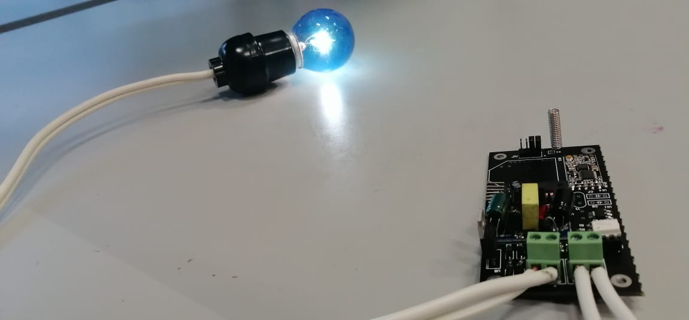 |
| Dimmer board connected to bulb (off state) | Dimmer board with bulb at full brightness |

| |
|---|
| 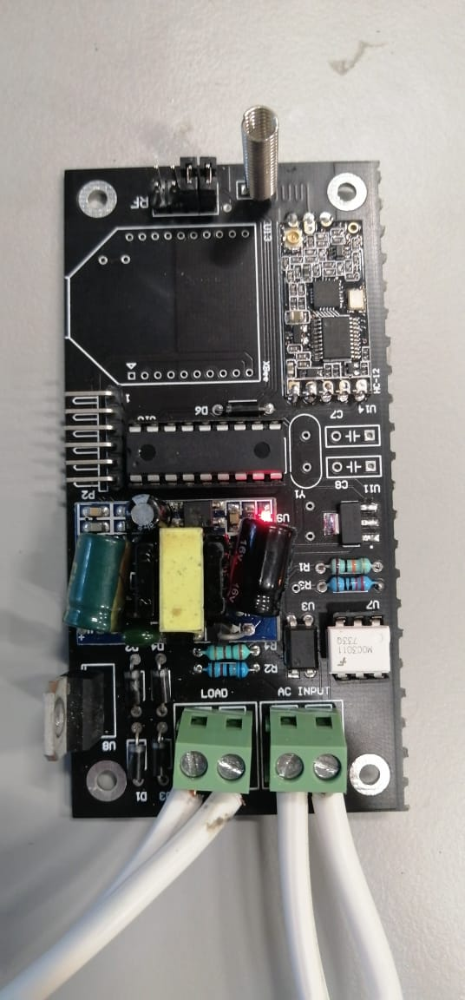 |
| PIC dimmer board mounted on wall with AC input and load connected |

### Full System
| | |
|---|---|
| 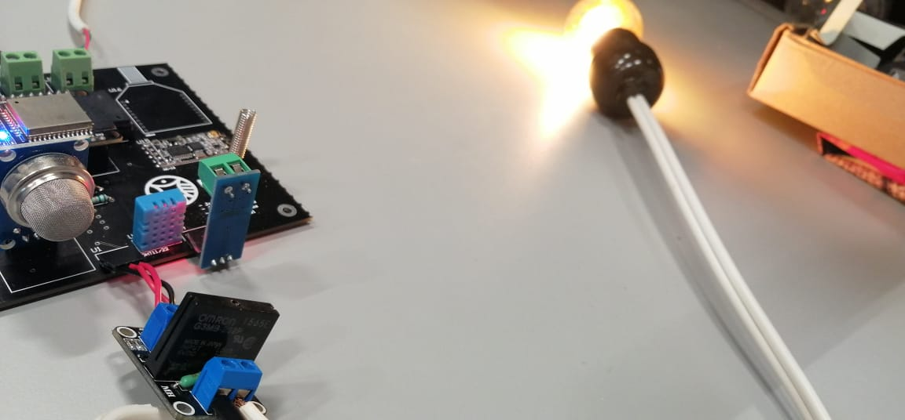 | 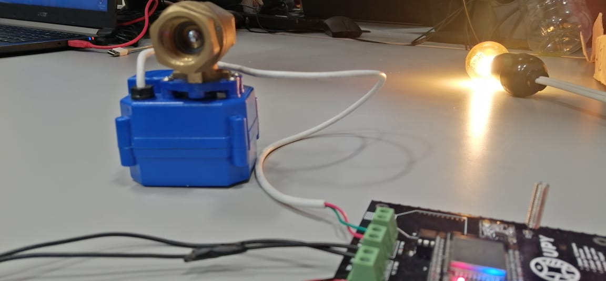 |
| ESP32 board with relay module controlling a bulb | Full system: solenoid valve + dimmed bulb + ESP32 board |

### Mobile App
| | |
|---|---|
|  | 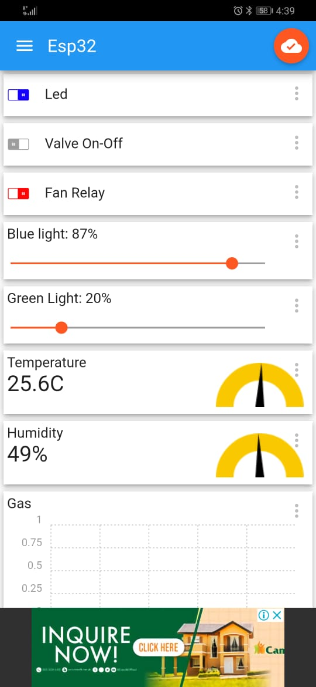 |
| Controls: LED, Valve, Fan Relay toggles + Blue/Green light sliders | Sensor readings: Temperature 25.6C, Humidity 49%, Gas level graph |
